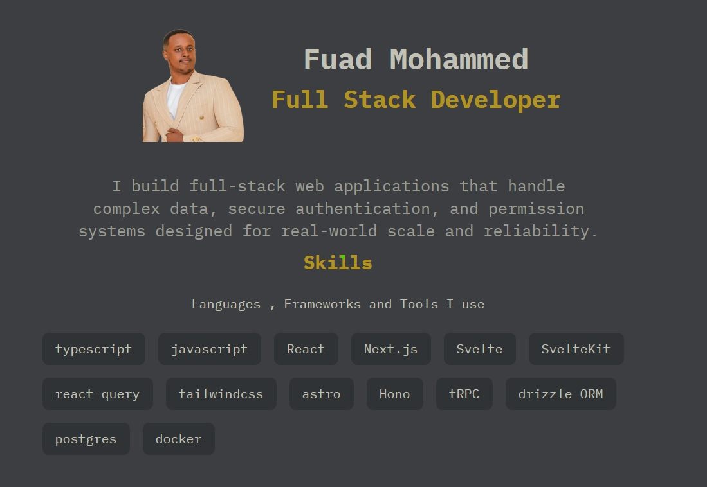

## About Me

I began coding in 2019 while pursuing a degree in Computer Science. During college, I also took on freelance work, which helped me gain real-world experience early on. I initially explored native development, but later transitioned to building web applications using TypeScript, React, and Next.js over the past two years. Since then, I’ve focused on developing internal tools , web apps that are data-heavy, include authentication and user role management, and often integrate AI-powered features.

<!--
**fuadmhd/fuadmhd** is a ✨ _special_ ✨ repository because its `README.md` (this file) appears on your GitHub profile.

Here are some ideas to get you started:

- 🔭 I’m currently working on ...
- 🌱 I’m currently learning ...
- 👯 I’m looking to collaborate on ...
- 🤔 I’m looking for help with ...
- 💬 Ask me about ...
- 📫 How to reach me: ...
- 😄 Pronouns: ...
- ⚡ Fun fact: ...
-->
