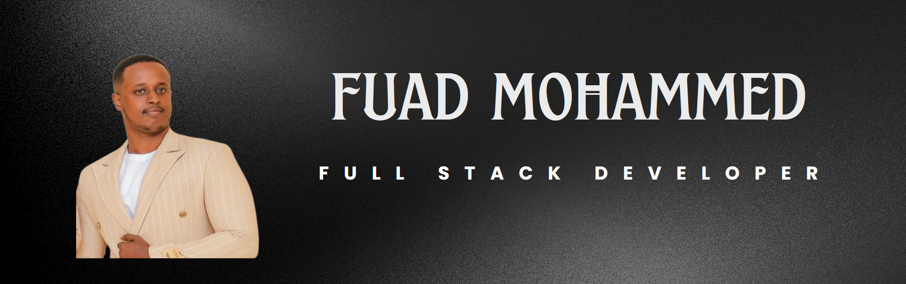

I build full-stack web applications that handle complex data, secure authentication, and permission systems designed for real-world scale and reliability.

*   🌍  I'm based in Ethiopia
*   🖥️  See my portfolio at [my portfolio](http://https://fuadmhd.vercel.app)
*   ✉️  You can contact me at [fuadmnur19@gmail.com](mailto:fuadmnur19@gmail.com)
*   🤝  I'm open to collaborating pn web projects 
*   ⚡  also i am BATMAN

### 🧰 Languages and Tools

 

## About Me

I began coding in 2019 while pursuing a degree in Computer Science. During college, I also took on freelance work, which helped me gain real-world experience early on. I initially explored native development, but later transitioned to building web applications using TypeScript, React, and Next.js over the past two years. ,mostly i work on  internal tools , web apps that are data-heavy, that need secure  authentication and user role management, and often integrate AI-powered features.

<!--
**fuadmhd/fuadmhd** is a ✨ _special_ ✨ repository because its `README.md` (this file) appears on your GitHub profile.

Here are some ideas to get you started:

- 🔭 I’m currently working on ...
- 🌱 I’m currently learning ...
- 👯 I’m looking to collaborate on ...
- 🤔 I’m looking for help with ...
- 💬 Ask me about ...
- 📫 How to reach me: ...
- 😄 Pronouns: ...
- ⚡ Fun fact: ...
-->
